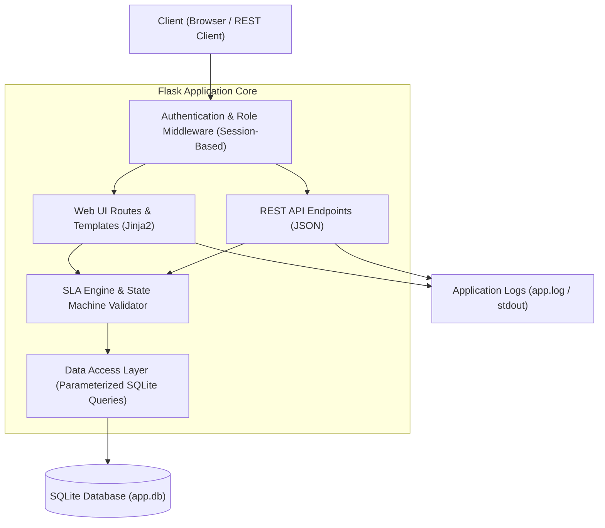
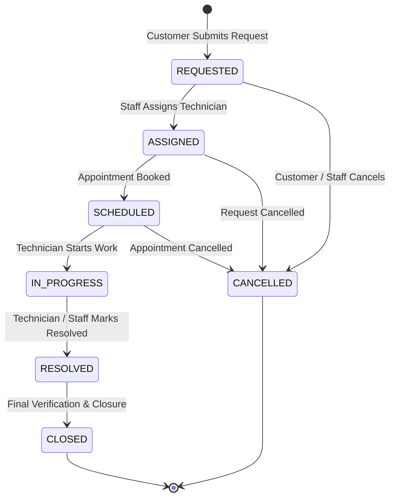
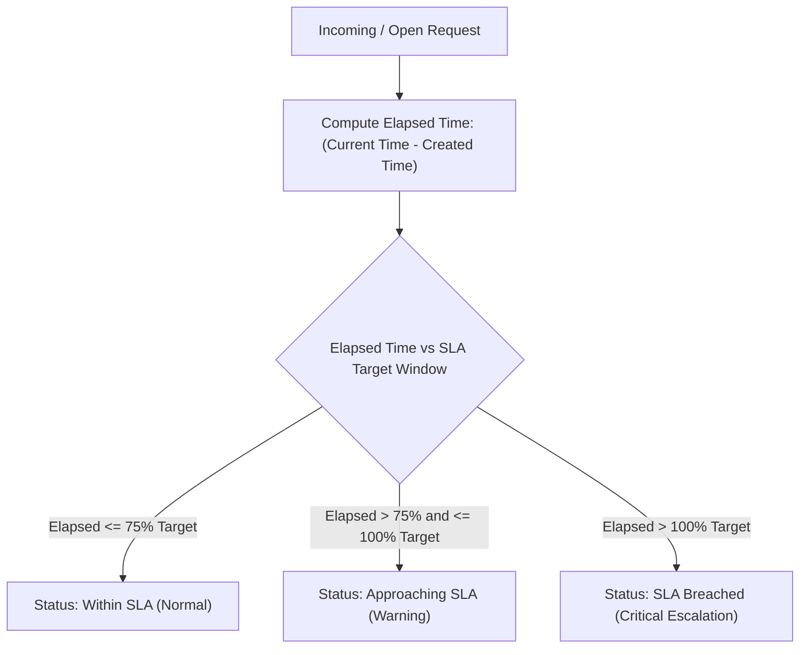
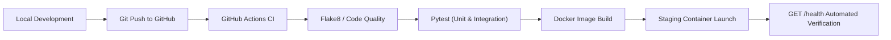

# System Architecture & Flowchart

## 1. High-Level Architecture

The **Online Repair Service Management System** follows a clean monolithic MVC pattern built on Python Flask with an embedded SQLite database engine.

---

## 2. Request Lifecycle Workflow

---

## 3. SLA Calculation Flow

---

## 4. Deployment Pipeline Flow

